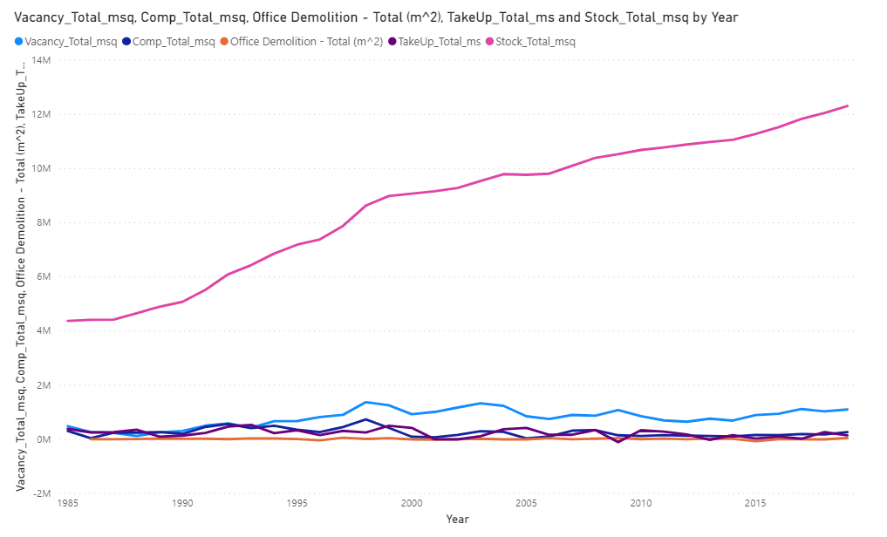
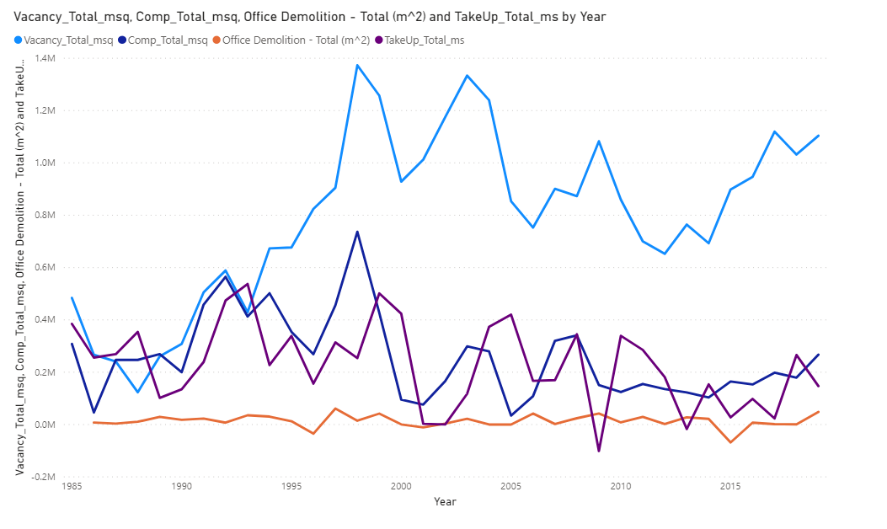
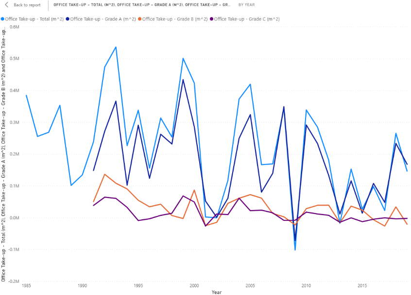
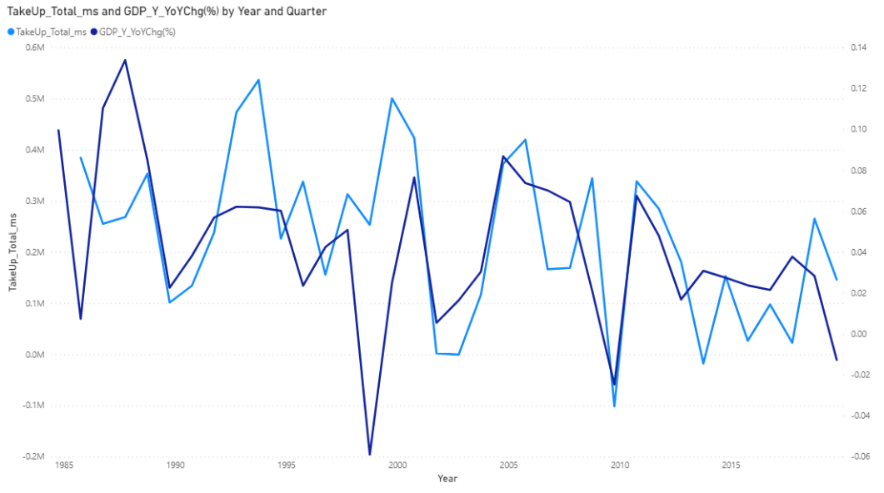
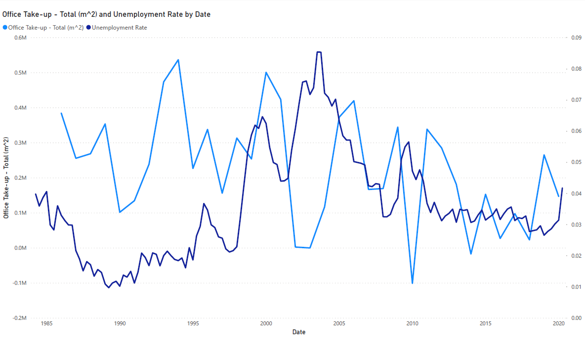

# Technical Notes on Office Demand Forecasting Model

## A. Overview
**Objective**: To build forecasting model on office demand

**Formulation of problem**:
- An indicator of office demand is Private Office Take-up (released by RVD), which will be used as the targeting variable for this exercise.
- Theoretically, factors and their respective indicators that predict/ correlates with office demand includes:
  - General economy situation – GDP, Hang Seng Index
  - Commercial activity – No. of registered companies, No. of new IPO, Business performance
  - Labour market situation (Demand side) – Labour force, No. of employed persons, Unemployment rate
  - Office market situation (Supply side) – Rental index, Price index

## B. Data collection
**The following data are collected from the Internet, automated data crawling program has been developed M&S and will be shared.**

|**Variables**|**Unit**|**Frequency**|**Data available range**|**Source**|
| :- | :- | :- | :- | :- |
|Private Office Take-up - Grade A-C, Total|m^2|Yearly|1991-2019|RVD|
|Private Office Completion - Grade A-C, Total|m^2|Yearly|1985-2019|RVD|
|Private Office Stock - Grade A-C, Total|m^2|Yearly|1985-2019|RVD|
|Private Office Vacancy - Grade A-C, Total|m^2|Yearly|1985-2019|RVD|
|Private Office Vacancy - Grade A-C, Total|% of stock|Yearly|1985-2019|RVD|
|Private Office Rental Index - Grade A-C|Index point|Quarterly|1986Q1-2020Q1|RVD|
|Private Office Rental Index - Overall|Index point|Quarterly|1978Q1-2020Q1|RVD|
|Private Office Rental Index - Grade A-C, Overall|Index point|Yearly|1981-2019|RVD|
|Private Office Rental Index - Grade A-C, Overall|Index point|Monthly|1/1993-3/2020|RVD|
|Private Office Price Index - Grade A-C, Overall|Index point|Quarterly|1986Q1-2020Q1|RVD|
|Private Office Price Index - Grade A-C, Overall|Index point|Yearly|1981-2019|RVD|
|Private Office Price Index - Grade A-C, Overall|Index point|Monthly|1/1993-3/2020|RVD|
|GDP in chained (2018) dollars|HK$M|Yearly|1961-2019|C&SD|
|GDP in chained (2018) dollars|HK$M|Quarterly|1973Q1-2020Q1|C&SD|
|Labour force|Thousand|Yearly|1982-2019|C&SD|
|No. of unemployed persons|Thousand|Yearly|1982-2019|C&SD|
|Labour force|Thousand|3MMA|08-10/1981 to 02-04/2020|C&SD|
|No. of unemployed persons|Thousand|3MMA|08-10/1981 to 02-04/2020|C&SD|
|HSI Daily Open|Index point|Daily|31/12/1986-29/5/2020|Yahoo!|
|HSI Daily High|Index point|Daily|31/12/1986-29/5/2020|Yahoo!|
|HSI Daily Low|Index point|Daily|31/12/1986-29/5/2020|Yahoo!|
|HSI Daily Close|Index point|Daily|31/12/1986-29/5/2020|Yahoo!, Wikipedia|
|HSI Daily Adj Close|Index point|Daily|31/12/1986-29/5/2020|Yahoo!|
|HSI Daily Volume|HK$|Daily|31/07/2001-29/5/2020|Yahoo!|
|No. of IPO (including GEM)|Unit|Yearly|1999-2019|HKEX|
|No. of local companies on the Companies Register|Unit|Yearly|03/1866-03/2012|CR|
|No. of local companies on the Companies Register|Unit|Yearly|12/2008-12/2019|CR|
|No. of local companies on the Companies Register|Unit|Monthly|03/2014-04/2020|CR|

**The following data is computed using the raw data.**

|**Variables**|**Unit**|**Frequency**|**Computation**|
| :- | :- | :- | :- |
|Private Office Vacancy - Total - year-on-year change|% (Change)|Yearly|TY / LY - 1|
|Private Office Vacancy - Demolition|m^2|Yearly|Completions TY + Vacancy LY - Vacancy TY - Take-up TY|
|Private Office Vacancy - Demolition|% of stock|Yearly|Demolition / Stock|
|Private Office Rental Index - Overall - year-on-year change|% (Change)|Yearly|TY / LY - 1|
|Private Office Price Index - Overall - year-on-year change|% (Change)|Yearly|TY / LY - 1|
|Real GDP - year-on-year growth|% (Change)|Yearly|TY / LY - 1|
|Unemployment rate|% (Rate)|Yearly|No. of unemployed persons / Labour force|
|Unemployment rate|% (Rate)|3MMA|No. of unemployed persons / Labour force|
|No. of employed persons|Thousand|Yearly|Labour force - No. of unemployed persons|
|No. of employed persons|Thousand|3MMA|Labour force - No. of unemployed persons|
|No. of employed persons - year-on-year change|Thousand (Change)|Yearly|TY - LY|
|No. of local companies on the Companies Register - year-on-year change|Unit (Change)|Yearly|TY - LY|
|No. of local companies on the Companies Register - year-on-year change|% (Change)|Yearly|TY / LY - 1|

## C. Data exploration
1. Statistics on office space
    - Organic growth of stock over the years (in line with the economy development)
    - No trends on Completion and Take-up, roughly random
    - Vacancy fluctuates between 0.7-1.4M m2 in recently 20 years
    - Demolition (as computed from the other statistics) is minimal
    - N.B. The statistics from RVD are not completely correct (e.g. components do not add up to total stocks, negative values for demolition)

2. Plot of Office Take-up by Grade
    - Grade A contributes the most portion of the Total 
    - The pattern looks random
    - The range maintains largely the same
    - Can build models around Total Office Take-up

3. Correlations of target variables with predictor variables
    - Office Take-up seems to be positively correlated with GDP YoY Change

    - Visually Office Take-up seems to have slight negative correlation with unemployment rate, However, for full series, correlation of the 2 series is low (≈ -0.1)

    - Numerically, stronger correlations are observed for Vacancy as compared to those for Take-up. It might be *easier to model on Vacancy than on Take-up*.

**Correlation between variables**

| |**Stock**|**Completions**|**Vacancy**|**Vacancy (% of Stock)**|**Vacancy Change**|**Demolition**|**Take-up**|
| :- | -: | -: | -: | -: | -: | -: | -: |
|**Stock**|1|-0.329|0.714|0.249|-0.004|-0.08|-0.317|
|**Completions**|-0.329|1|0.112|0.446|0.535|0.267|0.373|
|**Vacancy**|0.714|0.112|1|0.841|0.271|-0.03|-0.187|
|**Vacancy (% of Stock)**|0.249|0.446|0.841|1|0.397|0.02|0.004|
|**Vacancy (Change)**|-0.004|0.535|0.271|0.397|1|-0.041|-0.576|
|**Demolition**|-0.08|0.267|-0.03|0.02|-0.041|1|0.166|
|**Take-up**|-0.317|0.373|-0.187|0.004|-0.576|0.166|1|
|**Rental Index**|0.584|-0.014|0.165|-0.152|0.244|-0.026|-0.284|
|**Rental Index (% Change)**|-0.298|-0.204|-0.646|-0.704|-0.252|0.061|0.067|
|**Price Index**|0.71|-0.19|0.244|-0.164|0.111|-0.083|-0.305|
|**Price Index (% Change)**|-0.261|-0.09|-0.514|-0.55|-0.295|-0.001|0.241|
|**GDP**|0.944|-0.385|0.483|-0.028|-0.01|-0.102|-0.363|
|**GDP (% Change)**|-0.461|-0.221|-0.551|-0.432|-0.582|-0.111|0.447|
|**Labour Force**|0.988|-0.408|0.65|0.16|-0.005|-0.122|-0.39|
|**No. of unemployed persons**|0.605|-0.257|0.807|0.625|-0.063|-0.073|-0.178|
|**No. of employed persons**|0.972|-0.4|0.574|0.072|0.005|-0.12|-0.393|
|**Unemployment rate**|0.478|-0.191|0.772|0.673|-0.07|-0.059|-0.105|
|**No. of employed persons (Change)**|-0.084|-0.222|-0.27|-0.249|-0.363|-0.24|0.22|
|**HSI Close**|0.921|-0.332|0.547|0.078|-0.034|-0.055|-0.29|
|**HSI Close (% Change)**|-0.206|0.117|-0.113|-0.012|-0.101|0.154|0.209|
|**No. of companies**|0.875|-0.34|0.417|-0.064|0.051|-0.136|-0.383|
|**No. of companies (Change)**|0.256|-0.255|-0.256|-0.477|-0.21|0.104|-0.038|
|**No. of companies (% Change)**|-0.508|0.036|-0.779|-0.679|-0.245|0.147|0.29|

## D. Problem formulation
- Target variable Office Take-up is a composite variable:
>Take-up 
= Completions + Vacancy of LY – Demolition – Vacancy of TY 
= Completions – ΔVacancy – Demolition 
= Completions – Demolition + (Stock × Vacancy (% of Stock)) of LY – (Stock × Vacancy (% of Stock)) of TY

- RVD has already provided the forecasts of Completions for 2020 and 2021 in *Hong Kong Property Review*
- Since Demolition is very small as compared to Stock (<1% in each year), we assumed the value is zero in our prediction model
- Besides, stock is estimated by:
>Stock of TY  
= Stock of LY + Completions – Demolitions (assumed zero) 
= Stock of LY + Completions

- In sum, we only tackle with Vacancy in model building:
>Take-up	= Completions (known) – ΔVacancy – Demolition (assumed zero) 
Take-up	= Completions (known) – Demolition (assumed zero) + (Stock (known) × Vacancy (% of Stock)) of LY – (Stock (known) × Vacancy (% of Stock)) of TY

## E. Model building
General assumption:
- Use RVD’s forecast for completions of 2020 and 2021
- Demolition is assumed to be zero

Benchmark for performance:
- Office Take-up (yearly from 1986 to 2019)
  - Mean = 222,935m2
  - Standard deviation = 158,498m2

**[Model 1] Mean estimate on Vacancy YoY Change (m2)**
- Data: Yearly data from 1986 to 2019
- Target variable: Vacancy YoY Change (m2)
- Based on ACF test, there is no autocorrelation between any time lag, i.e. the data is random, hence the best estimation of next value is the mean value of time series
- Forecasting formulas
>∆Vacancy=18,232±349,224m2 
Take-up = Completions – ΔVacancy – Demolition
- Performance
>Mean absolute error = 154,393m2

**[Model 2] AR(1) model on Vacancy (% of Stock) [arimafit04]**
- Data: Yearly data from 1986 to 2019
- Target variable: Vacancy (% of Stock)
- Forecasting formulas
>Yt-0.0874=0.7447Yt-1-0.0874 
Stock of TY = Stock of LY + Completions – Demolitions 
Take-up = Completions – Demolition + Stock of LY × Vacancy (% of Stock) of LY – Stock of TY × Vacancy (% of Stock) of TY
- Performance
>AIC = -168.63 
Mean absolute error = 123,328m2

**[Model 3] MA(2) model on Vacancy (% of Stock) [arimafit05]**
- Data: Yearly data from 1986 to 2019
- Target variable: Vacancy (% of Stock)
- Forecasting formulas
>Yt-0.0892=Zt-0.0892+0.7540Zt-1-0.0892+0.4881Zt-2-0.0892 
Stock of TY = Stock of LY + Completions – Demolitions 
Take-up = Completions – Demolition + Stock of LY × Vacancy (% of Stock) of LY – Stock of TY × Vacancy (% of Stock) of TY 
- Performance
>AIC = -165.16 
Mean absolute error = 125,858m2

**[Model 4] Linear regression model on Vacancy (% of Stock) [lr08]**
- Data: Yearly data from 1986 to 2019
- Target variable: Vacancy (% of Stock)
- Predictor variable: Rental Index YoY Change (%), No. of Companies YoY Change
- Forecasting assumptions
  - Rental Indices of May-Dec 2020 stays the same as that in Apr 2020 = 245.4 → Average Rental Index in 2020 = 247.5
  - Change of no. of company = (No. of company in Apr 2020 – No. of company in Dec 2020) / 4 \* 12
  - Rental Indices of 2021 stays the same as that in Apr 2020 = 245.4
  - Assume change of no. of company in 2021 = that in 2020
- Forecasting formulas
>V=0.1071-0.1094R-2.881×10-7×C 
Stock of TY = Stock of LY + Completions – Demolitions 
Take-up = Completions – Demolition + Stock of LY × Vacancy (% of Stock) of LY – Stock of TY × Vacancy (% of Stock) of TY
- Performance
>Adjusted R-squared = 0.5871 
Mean absolute error = 118,193m2

**[Model 4a] Linear regression model on Vacancy (% of Stock) [lr09]**
- Data: Yearly data from 1986 to 2019
- Target variable: Vacancy (% of Stock)
- Predictor variable: Rental Index YoY Change (%), No. of Companies YoY Change, Unemployment Rate
- Forecasting assumptions
  - Same as those of Model 4
  - Unemployment Rate for 2020 and 2021 are 5% and 4% respectively
- Forecasting formulas
>V=0.08073-0.07591R-2.64×10-7×C+0.6415U 
Stock of TY = Stock of LY + Completions – Demolitions 
Take-up = Completions – Demolition + Stock of LY × Vacancy (% of Stock) of LY – Stock of TY × Vacancy (% of Stock) of TY
- Performance
>Adjusted R-squared = 0.7004 
Mean absolute error = 88,317m2

**[Model 5] VAR model on Vacancy (% of Stock) [VAR05]**
- Data: Yearly data from 1986 to 2019
- Target variable: Vacancy (% of Stock)
- Predictor variable: Rental Index YoY Change (%) (lag 0 and 1), No. of Companies YoY Change (lag 1)
- Forecasting assumptions
  - Same as those of Model 4
- Forecasting formulas
>Vt=0.1111-0.08226Rt-0.05593Rt-1-3.115×10-7×Ct-1 
Stock of TY = Stock of LY + Completions – Demolitions 
Take-up = Completions – Demolition + Stock of LY × Vacancy (% of Stock) of LY – Stock of TY × Vacancy (% of Stock) of TY
- Performance
>Adjusted R-squared = 0.7041 
Mean absolute error = 92,476m2

**[Model 6] VAR model on Vacancy (% of Stock) [VAR08]**
- Data: Yearly data from 1986 to 2019
- Target variable: Vacancy (% of Stock)
- Predictor variable: Real GDP Growth (%) (lag 0), Rental Index YoY Change (%) (lag 0 and 1), No. of Companies YoY Change (lag 1), Unemployment Rate (lag 0)
- Forecasting assumptions
  - Same as those of Model 4
  - Real GDP Growth for 2020 and 2021 are -5% and +0% respectively
  - Unemployment Rate for 2020 and 2021 are 5% and 4% respectively
- Forecasting formulas
>Vt=0.1052-0.2208Gt-0.04566Rt-0.05560Rt-1-3.071×10-7×Ct-1+0.3344Ut 
Stock of TY = Stock of LY + Completions – Demolitions 
Take-up = Completions – Demolition + Stock of LY × Vacancy (% of Stock) of LY – Stock of TY × Vacancy (% of Stock) of TY
- Performance
>Adjusted R-squared = 0.7991 
Mean absolute error = 74,673m2

**Forecasting model summary**

Forecast on Private Office Take-up – Total (m2)

|**Model**|**Model 1**|**Model 2**|**Model 3**|**Model 4**|**Model 4a**|**Model 5**|**Model 6**|
| -: | :-: | :-: | :-: | :-: | :-: | :-: | :-: |
|**Take-up (sq. m)**|**2020 Forecast**|**+59,468**|**+77,952**|**+85,615**|**-175,011**|**-227,198**|**-239,789**|**-549,648**|
||**2021 Forecast**|**+274,268**|**+271,950**|**+243,431**|**+322,491**|**+383,645**|**+337,282**|**+524,104**|
||*Back-testing Mean Absolute Error*|*154,393*|*123,328*|*125,858*|*118,193*|*88,317*|*92,476*|*74,673*|
|**Target Variable**|Vacancy YoY Change (sq. m)|Vacancy (% of Stock)|Vacancy (% of Stock)|Vacancy (% of Stock)|Vacancy (% of Stock)|Vacancy (% of Stock)|Vacancy (% of Stock)|
|**Regression coefficient**|(Intercept)| | | |0.107|0.081|0.111|0.105|
||Rental Index YoY Change (%)| | | |-0.109|-0.076|-0.082|-0.046|
||Rental Index YoY Change (%) (lag 1)| | | | | |-0.056|-0.056|
||No. of Companies YoY Change| | | |-2.88E-07|-2.64E-07| | |
||No. of Companies YoY Change (lag 1)| | | | | |-3.11E-07|-3.07E-07|
||Real GDP Growth (%)| | | | | | |-0.221|
||Unemployment Rate| | | | |0.642| |0.334|
|**Standardised regression coefficient**|Rental Index YoY Change (%)| | | |-0.633|-0.439|-0.476|-0.264|
||Rental Index YoY Change (%) (lag 1)| | | | | |-0.324|-0.322|
||No. of Companies YoY Change| | | |-0.348|-0.319| | |
||No. of Companies YoY Change (lag 1)| | | | | |-0.376|-0.371|
||Real GDP Growth (%)| | | | | | |-0.290|
||Unemployment Rate| | | | |0.395| |0.206|

## F. Discussion
**The models**
- Model 4 and 5 suggested that change in Rental Index and change in No. of Companies significantly predicts Office Take-up.
- Model 5 further suggested that both predictors are leading indicators, which is in line with the logic that company owners first register new companies then rent offices.
- By factoring in the recent changes in rental price, Model 4 and 5 predict negative Take-up in 2020, which echoes with the findings in property market reports from JLL and Centaline.
- Office Vacancy also correlates with Unemployment Rate and GDP Growth. More robust models – Model 4a and 6 have those variables factored in and produced more robust models.

**Limitation of the models**
- Since only the yearly data for the target variable is available (with around 30 time points), these models are built on yearly time frame with small sample size.
- For Model 4, 4a, 5, 6, need to assign values for the predictor variables before calculating forecast, different assumptions have to be made.
- Assumption has to be put to interpolate the yearly data into finer timeframe, different interpolation methods could produce different resolutions.
- Suggested to further explore alternative data sources.

**Property market**
- With reference to property market reports compiled by real estate related companies, office rental price in Jan-Apr 2020 dropped and vacancy increased, particularly for Kowloon East.

